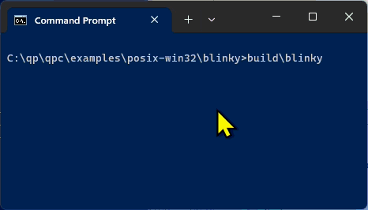
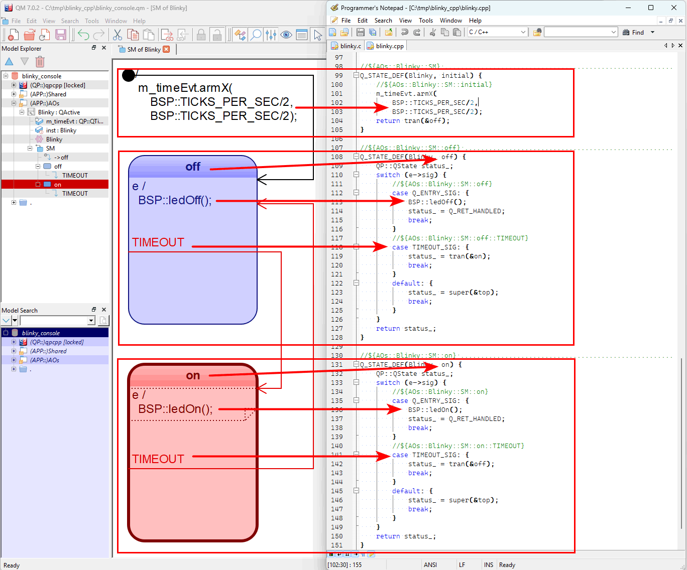

# Example: Blinky Console

This example corresponds to the QM Tutorial at:

https://www.state-machine.com/qm/gs_tut.html

The following files comprise the project:

- the `blinky_console.qm` model file, from which all other
  files are generated:

  - `blinky.cpp` - the generated code for the Blinky application
  - `bsp.hpp`    - the generated code for the Board Support Package
  - `bsp.cpp`    - the generated code for the Board Support Package
  - `main.cpp`   - the generated code for the main function
  - `Makefile`   - the generated makefile to build Blinky on Windows/Linux/macOS

> NOTE: The code for the Blinky example has been generated automatically
by the [QM modeling tool](https://www.state-machine.com/products/qm).
However, the code is very readable and can be created manually without any tools.

## Blinky State Machine and Code

